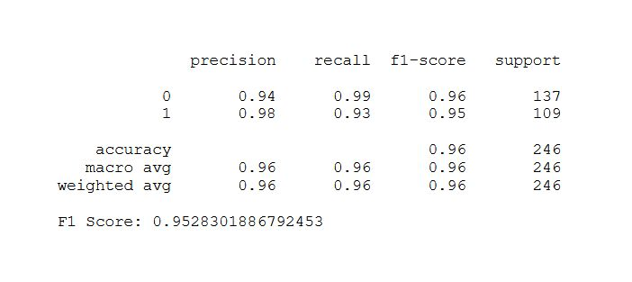

# Detección de fraudes con tarjetas de crédito mediante machine learning


Este script ejecuta un método de aprendizaje automático para detectar transacciones fraudulentas con tarjetas de crédito.
El conjunto de datos contiene 284.807 transacciones con tarjetas de crédito realizadas en 2013 en Europa, con 492 fraudes. Las variables no son las originales por motivos de confidencialidad, sino 28 nuevas derivadas de una reducción de datos mediante análisis de componentes principales (ACP). Solo dos características no se transformaron: «Tiempo» e «Importe». La variable objetivo es «Clase» y tiene un valor de 1 (fraude) o 0 (no fraude). El conjunto de datos se puede encontrar [aquí](https://tinyurl.com/4zvuh435/).

### Código Python:

### 1. Importar bibliotecas
```
import pandas as pd
import numpy as np
import seaborn as sns
import matplotlib.pyplot as plt
import warnings
warnings.filterwarnings('ignore')
%matplotlib inline
```
### 2. Cargar la base de datos en formato csv
```
df = pd.read_csv('creditcard.csv')
```
El conjunto de datos presenta un alto desequilibrio, ya que los valores de clase positivos (fraudes) representan solo el 0,172 % de las transacciones. Por lo tanto, los casos con clase = 0 estarán submuestreados.

### 3. Submuestreo del conjunto de datos desbalanceados:
```
# Determinar las frecuencias de la clase
counts = df['Class'].value_counts()
min_count = counts.min()

# Función de submuestreo
df_balanced = pd.concat([
    df[df['Class'] == cls].sample(n=min_count, random_state=42)
    for cls in counts.index
])

# Submuestrear y guardar el nuevo conjunto de datos más pequeño
df_balanced.sample(frac=1, random_state=42).to_csv('creditcard_2.csv', index=False)
print('Undersampled output dataset has been saved')
```
### 4. Data info
```
df.info()
```
Resultado:


### 5. Definir las variables X e y
```
X = df.drop(columns=['Class'], axis=1)
y = df['Class']
```
### 6. Entrenamiento y testeo del modelo
```
# Dividir los datos
from sklearn.model_selection import train_test_split
from sklearn.metrics import classification_report, f1_score
x_train, x_test, y_train, y_test = train_test_split(x_scaler, y, test_size=0.25, random_state=42)
```
### 7. Modelo de clasificación XGBoost
```
from xgboost import XGBClassifier
model = XGBClassifier(n_jobs=-1)
```
### 8. Entrenamiento del modelo
```
model.fit(x_train, y_train)
```
### 9. Predicción y testeo
```
y_pred = model.predict(x_test)
print(classification_report(y_test, y_pred))
print("F1 Score:",f1_score(y_test, y_pred))
```


### Conclusión:

el modelo XGBoost presenta un alto nivel de poder predictivo de situaciones de fraude bancario mediante uso indebido de una tarjeta de crédito.
