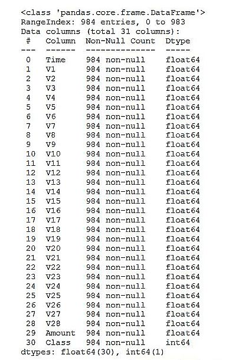

# Credit Card Fraud Detection using Machine Learning


This script performs a machine learning method to detect credit card fraudulent transactions. 
The dataset contains 284,807 credit card transactions made in 2013 in Europe, with 492 frauds. The variables are not the original due to confidentiality reasons, but 28 new ones from a principal component analysis (PCA) data reduction. Only two features were not transformed: 'Time' and 'Amount'. The target variable is 'Class' and has a value 1 (fraud) or 0 (not fraud). The dataset can be found [here](https://tinyurl.com/4zvuh435/).

### Python code:

### 1. Import libraries
```
import pandas as pd
import numpy as np
import seaborn as sns
import matplotlib.pyplot as plt
import warnings
warnings.filterwarnings('ignore')
%matplotlib inline
```
### 2. Load the csv data
```
df = pd.read_csv('creditcard.csv')
df.head()
# i) Time attributes are in the terms of timestamp. ii) The class attribute shows 0 indicates non fraudulent transactions
# and 1 indicates fraudulent transactions. iii) The amount is in EUROs.
```
### 3. Data preprocessing
### 3.1. Datatype info
```
df.info()
# All the attributes (columns 0-29) are floats and the target (column 30) is Integer:
```
Output:



### 3.2. statistical info
```
df.describe()
# Due to the difference in the range (min) & (max) of columns, a standard scalar transformation will be performed later 
```
### 3.3. Check for null values
```
df.isnull().sum()
```
### 3.4. Exploratory Data Analysis
### Explore the categorical column "Class"
```
sns.countplot(df['Class'])
# The number of fraudulent classes is low. Therefore, the data must be balanced for acceptable results.
```
### 4. Define X and y variables
```
X = df.drop(columns=['Class'], axis=1)
y = df['Class']
```
### 5. Model Training and Testing
```
# Splitting the Data
from sklearn.model_selection import train_test_split
from sklearn.metrics import classification_report, f1_score
x_train, x_test, y_train, y_test = train_test_split(x_scaler, y, test_size=0.25, random_state=42)
```
### 6. XGBoost classification model
```
from xgboost import XGBClassifier
model = XGBClassifier(n_jobs=-1)
```
### 7. Training the model
```
model.fit(x_train, y_train)
```
### 8. Predicting and testing
```
y_pred = model.predict(x_test)
print(classification_report(y_test, y_pred))
print("F1 Score:",f1_score(y_test, y_pred))
```
